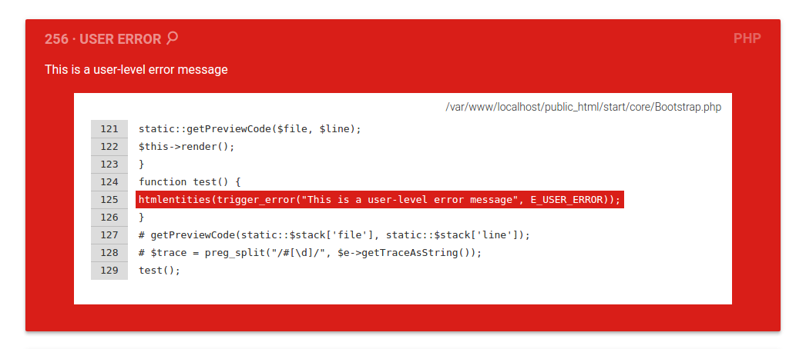

# PHP ErrorHandler library

[](https://packagist.org/packages/josantonius/ErrorHandler) [](https://packagist.org/packages/josantonius/ErrorHandler) [](LICENSE) [](https://www.codacy.com/app/Josantonius/PHP-ErrorHandler?utm_source=github.com&amp;utm_medium=referral&amp;utm_content=Josantonius/PHP-ErrorHandler&amp;utm_campaign=Badge_Grade) [](https://packagist.org/packages/josantonius/ErrorHandler) [](https://travis-ci.org/Josantonius/PHP-ErrorHandler) [](http://www.php-fig.org/psr/psr-2/) [](http://www.php-fig.org/psr/psr-4/) [](https://codecov.io/gh/Josantonius/PHP-ErrorHandler)

[English version](README.md)

Biblioteca PHP para manejar excepciones y errores.

---

- [Instalación](#instalación)
- [Requisitos](#requisitos)
- [Cómo empezar y ejemplos](#cómo-empezar-y-ejemplos)
- [Métodos disponibles](#métodos-disponibles)
- [Uso](#uso)
- [Tests](#tests)
- [Imágenes](#imagenes)
- [Tareas pendientes](#-tareas-pendientes)
- [Contribuir](#contribuir)
- [Repositorio](#repositorio)
- [Licencia](#licencia)
- [Copyright](#copyright)

---

### Requisitos

Esta clase es soportada por versiones de `PHP 5.6` o superiores y es compatible con versiones de `HHVM 3.0` o superiores.

### Instalación 

La mejor forma de instalar esta extensión es a través de [Composer](http://getcomposer.org/download/).

Para instalar `PHP ErrorHandler library`, simplemente escribe:

    $ composer require Josantonius/ErrorHandler

El comando anterior sólo instalará los archivos necesarios, si prefieres **descargar todo el código fuente** puedes utilizar:

    $ composer require Josantonius/ErrorHandler --prefer-source

También puedes **clonar el repositorio** completo con Git:

  $ git clone https://github.com/Josantonius/PHP-ErrorHandler.git

O **instalarlo manualmente**:

[Descargar ErrorHandler.php](https://raw.githubusercontent.com/Josantonius/PHP-ErrorHandler/master/src/ErrorHandler.php):

    $ wget https://raw.githubusercontent.com/Josantonius/PHP-ErrorHandler/master/src/ErrorHandler.php

### Métodos disponibles

Métodos disponibles en esta biblioteca:

`Set customs methods to renderizate:`

```php
ErrorHandler::setCustomMethod($class, $method, $repeat, $default);
```

| Atributo | Descripción | Tipo | Requerido | Predeterminado
| --- | --- | --- | --- | --- |
| $class | Nombre de la clase u objeto. | callable | Yes | |
| $method | Nombre del método. | string | Yes | |
| $repeat | Número de veces que repetir el método en caso de múltiples errores. | int | No | 0 |
| $default | Mostrar vista por defecto. | boolean | No | false |

**# Return** (void)

### Cómo empezar

Para utilizar esta biblioteca, simplemente:

```php
require __DIR__ . '/vendor/autoload.php';

use Josantonius\ErrorHandler\ErrorHandler;
```

Si la instalaste `manualmente`, utiliza:

```php
require_once __DIR__ . '/ErrorHandler.php';

use Josantonius\ErrorHandler\ErrorHandler;
```

### Uso

Ejemplo de uso para esta biblioteca:

```php
/* Se recomienda intanciar la clase en un archivo base como el index.php */

new ErrorHandler;

/**
 * Opcionalmente puedes introducir uno o más métodos para ejecutar en lugar de
 * la vista predeterminada. El método indicado recibirá un array con los
 * siguientes parámetros:
 *
 * [
 * 	'type'      => 'Error|Exception',
 *	'message'   => 'exception|error mensaje',
 *	'file'      => 'exception|error archivo',
 *	'line '     => 'exception|error línea',
 *	'code'      => 'exception|error código de error',
 *	'http-code' => 'Código de estado de respuesta HTTP',
 *	'mode'      => 'PHP|HHVM',
 * ];
 * 
 */

$class   = $this;
$method  = 'customMethodResponse';
$times   = 0;
$default = true;

ErrorHandler::SetCustomMethod($class, $method, $times, $default);
```

### Tests 

Para ejecutar las [pruebas](tests) necesitarás [Composer](http://getcomposer.org/download/) y seguir los siguientes pasos:

    $ git clone https://github.com/Josantonius/PHP-ErrorHandler.git
    
    $ cd PHP-ErrorHandler

    $ composer install

Ejecutar pruebas unitarias con [PHPUnit](https://phpunit.de/):

    $ composer phpunit

Ejecutar pruebas de estándares de código [PSR2](http://www.php-fig.org/psr/psr-2/) con [PHPCS](https://github.com/squizlabs/PHP_CodeSniffer):

    $ composer phpcs

Ejecutar todas las pruebas anteriores:

    $ composer tests

### Imágenes





### ☑ Tareas pendientes

- [x] Completar tests
- [ ] Mejorar la documentación

### Contribuir

1. Comprobar si hay incidencias abiertas o abrir una nueva para iniciar una discusión en torno a un fallo o función.
1. Bifurca la rama del repositorio en GitHub para iniciar la operación de ajuste.
1. Escribe una o más pruebas para la nueva característica o expón el error.
1. Haz cambios en el código para implementar la característica o reparar el fallo.
1. Envía pull request para fusionar los cambios y que sean publicados.

Esto está pensado para proyectos grandes y de larga duración.

### Repositorio

Los archivos de este repositorio se crearon y subieron automáticamente con [Reposgit Creator](https://github.com/Josantonius/BASH-Reposgit).

### Licencia

Este proyecto está licenciado bajo **licencia MIT**. Consulta el archivo [LICENSE](LICENSE) para más información.

### Copyright

2016 - 2017 Josantonius, [josantonius.com](https://josantonius.com/)

Si te ha resultado útil, házmelo saber :wink:

Puedes contactarme en [Twitter](https://twitter.com/Josantonius) o a través de mi [correo electrónico](mailto:hello@josantonius.com).